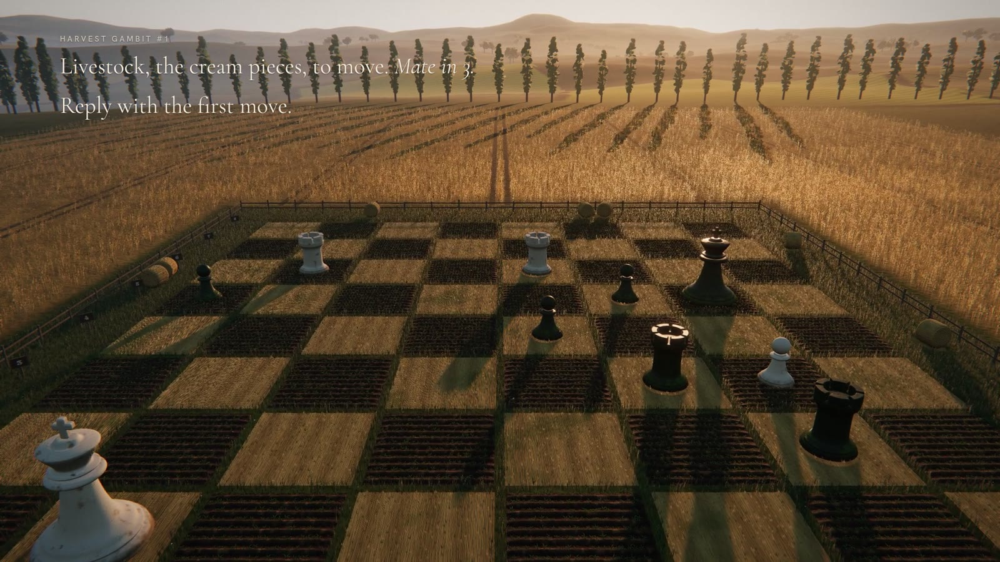
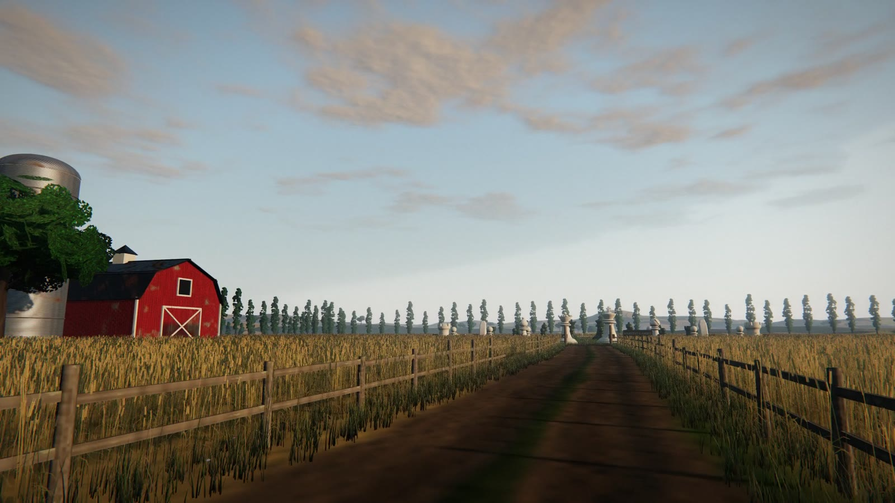
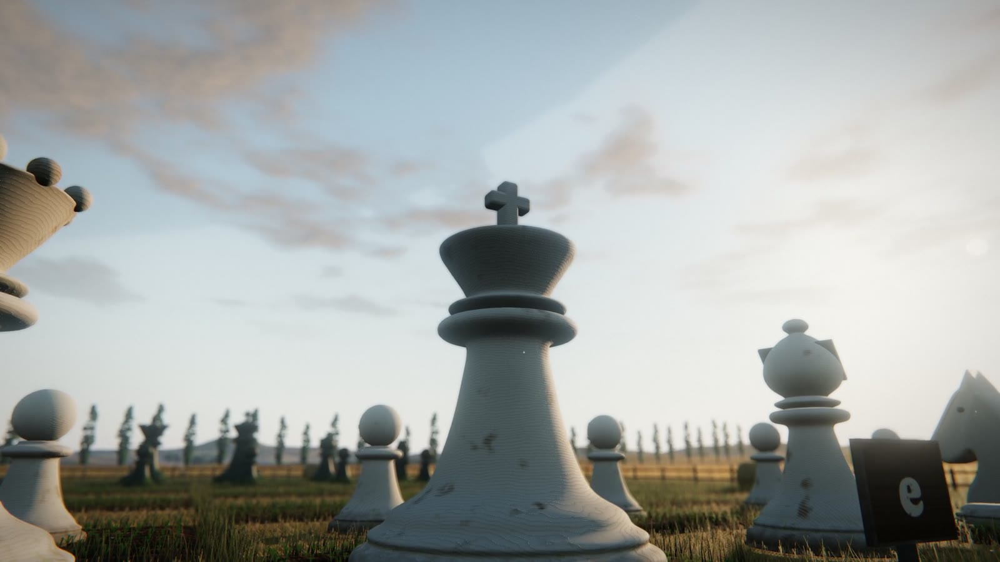
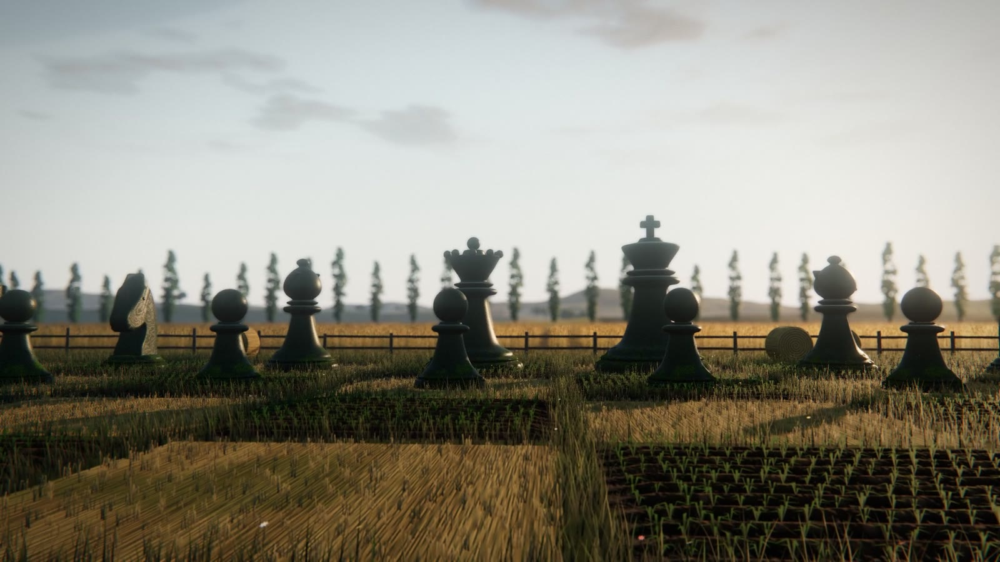
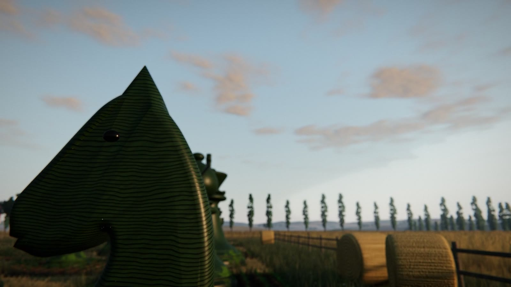
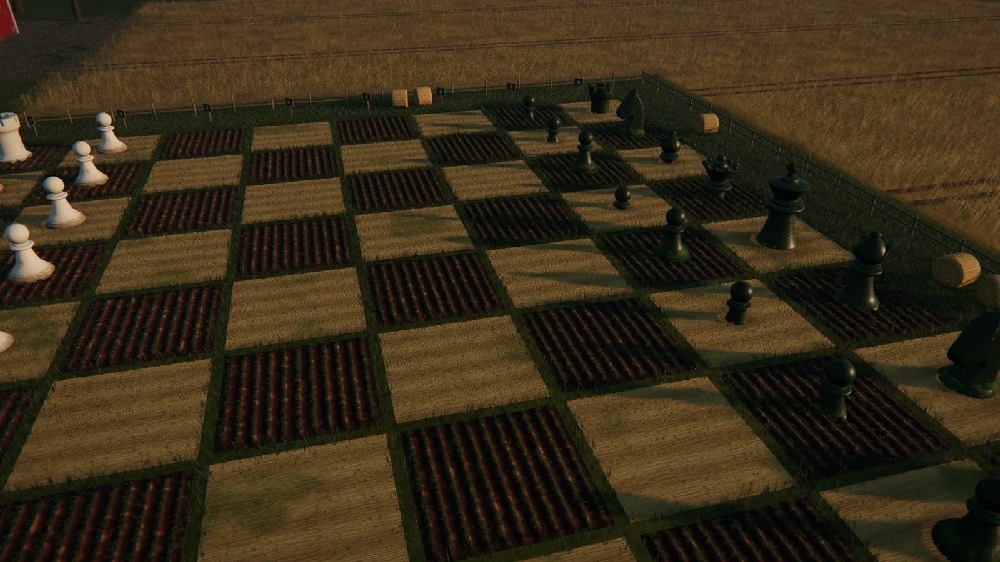
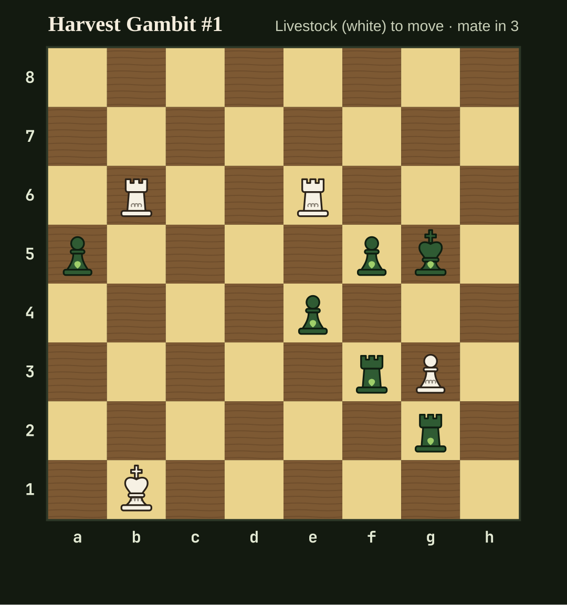

# Harvest Gambit

A life-size chessboard in a wheat field, built entirely from code. No 3D models, no textures, no footage, no AI video:
the farm, the carved pieces, the sky, the light and the soundtrack are all generated by the programs in this repo.



**Play it:** https://rohithreddy1095.github.io/harvest-gambit/play/ (the film, playable live:
https://rohithreddy1095.github.io/harvest-gambit/film/)

It comes in two parts that share one world:

- **The film.** A 66-second walk from a misty dawn aerial, down a farm road, through the gate between a 5.3 m King and
  a 4.6 m Queen, across the field to the Crops army. At the end both armies sink into the soil and puzzle #1 grows up
  out of it. It is rendered frame by frame in headless Chromium, with a soundtrack synthesised sample by sample.
- **The playable field** (`play/index.html`). Three easy mate-in-3 puzzles on the same field. Tap a cream piece and
  its legal squares light up in the wheat; tap one and the piece slides there, and the Crops answer. On checkmate the
  Crops king falls over, and you get a spoiler-free result line to share.

| | | |
|---|---|---|
|  |  |  |
|  |  |  |

## What is generated

Everything you see or hear comes from code in `film/`:

- **Land:** terrain out to mountains 6 km away, a patchwork of fields with tramlines and hedgerows, a dirt road with
  ruts, and mist that settles in the low ground.
- **Crops:** 624,463 wheat stalks with textured ears that bend in travelling gusts and glow gold when backlit.
  Also 359,216 grass blades, stubble, seedlings on the ploughed squares, wildflowers and 1,184 trees.
- **The board:** dark squares are real furrowed geometry; light squares are mown stubble.
- **The pieces:** lathe-turned Staunton shapes and an extruded knight, carved from procedural wood. The Livestock
  pieces are whitewashed oak with lichen; the Crops pieces are green-stained oak with moss.
- **The farm:** a gambrel barn, a grain silo, a spinning windpump, fences, hay bales, painted file and rank stakes,
  and a flock of geese.
- **Light and sky:** an atmospheric sky with the sun moving through a whole day, image-based lighting from that sky,
  height fog, clouds, drifting dust, bloom, depth of field and a film grade.
- **Sound** (`film/sound.mjs`): an additive string pad, a modelled piano, wind, wheat rustle, birdsong, geese, a
  windpump that creaks in time with its rotor, crickets and the rumble of the field replanting itself.

## How it fits together

```
film/src/world.js          the world: terrain, vegetation, farm, pieces, sky and light rig
film/src/film.js           the film's camera path, title cards and the replanting ending
film/src/puzzle.js         the playable field: picking, move animation, puzzle logic
film/src/template-*.html   page shells for the film and the field
film/build.mjs             assembles film/index.html and play/index.html from the pieces above
film/render.mjs            drives headless Chromium frame by frame and pipes frames to ffmpeg
film/make-film.sh          renders at 2x supersampling, adds the soundtrack, encodes for X
film/sound.mjs             synthesises the soundtrack to film/out/sound.wav
puzzles/fetch.sh           streams the Lichess puzzle database and keeps easy mate-in-3 candidates
puzzles/verify.mjs         checks every candidate with an exhaustive mate search
puzzles/selected.json      the three puzzles in use
```

## Run it

```sh
npm install
npm run build                  # writes film/index.html and play/index.html
python3 -m http.server         # then open http://localhost:8000/play/ or /film/
```

The pages load three.js and chess.js from jsDelivr, so they need a network connection.

### Render the film

Needs Chromium (set `CHROME_PATH` if it isn't at `/usr/bin/chromium`), ffmpeg with libx264, and a GPU that
headless Chromium can use.

```sh
npm run stills                 # a few frames to film/out/ for checking
npm run sound                  # film/out/sound.wav
npm run film                   # film/out/harvest-gambit-1.mp4
```

`make-film.sh` renders in 6-second segments and keeps each one as it finishes, so if it is interrupted, running it
again carries on from where it stopped. On the 2012 laptop this was made on (Intel HD 4000), the 2x supersampled
film takes about an hour.

That GPU loses its WebGL context whenever a multisampled render target is used. Both pages therefore use SMAA for
anti-aliasing, and the film adds supersampling on top.

## The puzzles

The puzzles come from the [Lichess puzzle database](https://database.lichess.org/#puzzles), which is public domain
(CC0). `puzzles/verify.mjs` does not take them on trust. It runs an exhaustive mate search on each candidate and
keeps a puzzle only if all of these hold:

- White mates in 3 against every defence and cannot mate faster.
- Exactly one first move works.
- The line has no castling, en passant or promotion.
- There are at most 14 pieces.

It also builds an answer tree, so the field accepts every correct continuation and not just the one Lichess recorded.

```sh
./puzzles/fetch.sh             # ~300 MB download, filtered as it streams
node puzzles/verify.mjs 500    # writes puzzles/verified.json
node puzzles/diagram.mjs 1     # a flat diagram of puzzle #1
```

## The original match tool

Before the puzzles, the plan was a public match played one move a day: followers reply with moves on X, and the
most-liked legal reply is played. `hg.js` and `lib/` still run that game, including a parser that turns replies
like `knight to f3!!` or `castle short` into legal moves (`node test.js` tests it). `./hg.js` lists the commands.

## Harvest Bench

`bench/` turns this project into a benchmark for AI coding agents. It includes:

- a brief and a deliverables contract;
- a container every agent works in;
- a runner for Claude Code, Codex and Gemini CLI;
- an automated checker that re-verifies the puzzles and plays them through the page;
- blind side-by-side judging.

See [bench/README.md](bench/README.md).

## Credits

- [three.js](https://threejs.org) (MIT) for rendering, [chess.js](https://github.com/jhlywa/chess.js) (BSD-2-Clause)
  for move rules, [Puppeteer](https://pptr.dev) (Apache-2.0) for headless rendering.
- Puzzles from the [Lichess](https://lichess.org) open database (CC0).
- Fonts from Google Fonts (SIL Open Font License): Cormorant Garamond, Hanken Grotesk and Caprasimo.
- Written with [Claude](https://claude.ai) in one conversation.

## License

MIT, see [LICENSE](LICENSE). The puzzles themselves are from Lichess and are in the public domain (CC0).
